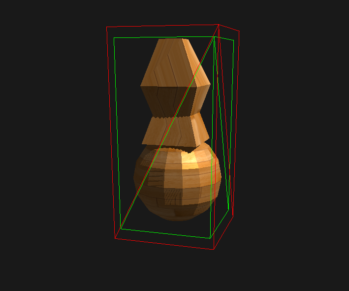

I've been wanting to explore this idea of creating shadows using raymarch + 3D texture (contains SDF information of a triangle mesh). This will replace the conventional shadow mapping method when trying to find whether a spot is occluded or not. I think the idea has been implemented in unreal/godot/some other engine in some shape or form, but I'm not entirely sure. For now I will be trying to do this on the CPU first (with some help from the GPU) until I fully nail down the implementation before moving on to code all of them in shaders.

We can pre-process the mesh accordingly to prepare it for the raymarch.
 1. Prepare a mesh, in this case I just made some random mesh in blender to try it out on
 
 2. Generate a bounding box that is a bit bigger than the original bounding box.
 
 3. Subdivide these boxes and find the closest distance to the mesh and save it in a 3d array.
 
 4. Determine the inside and outside of each boxes (give + to outside points, and - to inside points)
**_NOTE:_**  There is still some issue with my implementation of this. Green should be inside and red should be outside.
    - **My implementation:** check the dot product between face normal and raytrace from point to closest face 
    - Another way to do this, according to Unreal's slide is: 
    Which I can implement in a bit, still I'm a bit worried with the performance of the raytrace since I don't have any acceleration structures yet (especially on high poly meshes).
 
  
 Well anyway, after the pre-process steps, we can then run a raymarch to check for the occlussion. However, since I'm still running into issue with the determining the signs I'm not yet able to get a good visualization of the raymarch, perhaps next week once I iron out the issues.

 
 

----

Check out some reference that I used for this:
- Kosmonaut has done this better than I did! 
    - [https://kosmonautblog.wordpress.com/2017/05/01/signed-distance-field-rendering-journey-pt-1/](https://kosmonautblog.wordpress.com/2017/05/01/signed-distance-field-rendering-journey-pt-1/)
    - [https://kosmonautblog.wordpress.com/2017/05/09/signed-distance-field-rendering-journey-pt-2/](https://kosmonautblog.wordpress.com/2017/05/09/signed-distance-field-rendering-journey-pt-2/)
- Unreal's slide [https://advances.realtimerendering.com/s2015/DynamicOcclusionWithSignedDistanceFields.pdf](https://advances.realtimerendering.com/s2015/DynamicOcclusionWithSignedDistanceFields.pdf)