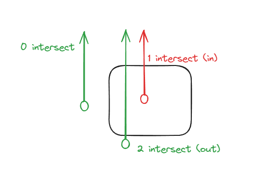
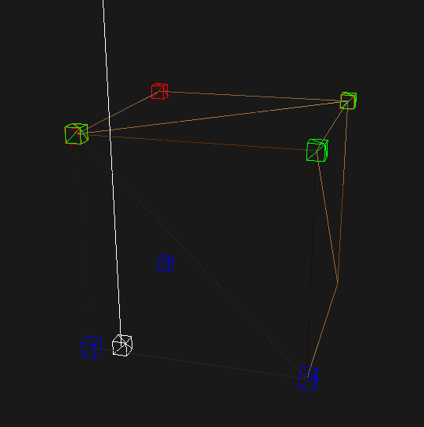

In [SDF exploration pt 1](), I mentioned that using dot(faceNormal, sdfPoint) doesn't work that well to determine the sign of the SDF. 

I am changing the idea to trace upwards from sdfPoint. If intersection count is even it's outside otherwise it's inside.
 

However, I quickly run into issues where there are outside points that is treated as inside points
 .
 - White point = sdfPoint
 - White line = raytrace upwards
 - Colored boxes = intersected triangles vertices

This should be in OUT sdfPoint because it goes through 2 face (bottom and top), but in reality it is considered as an IN sdfPoint because it intersects with 3 triangles (1 bottom and 2 top tris). This is because the sdfpoint traces through the line of the top triangle, hence it is counted as 2 intersections.

I have some ideas on how to fix this (finding distance between 2 intersection points, if it's too close then we just reject such point). Will update the result here later.

----
