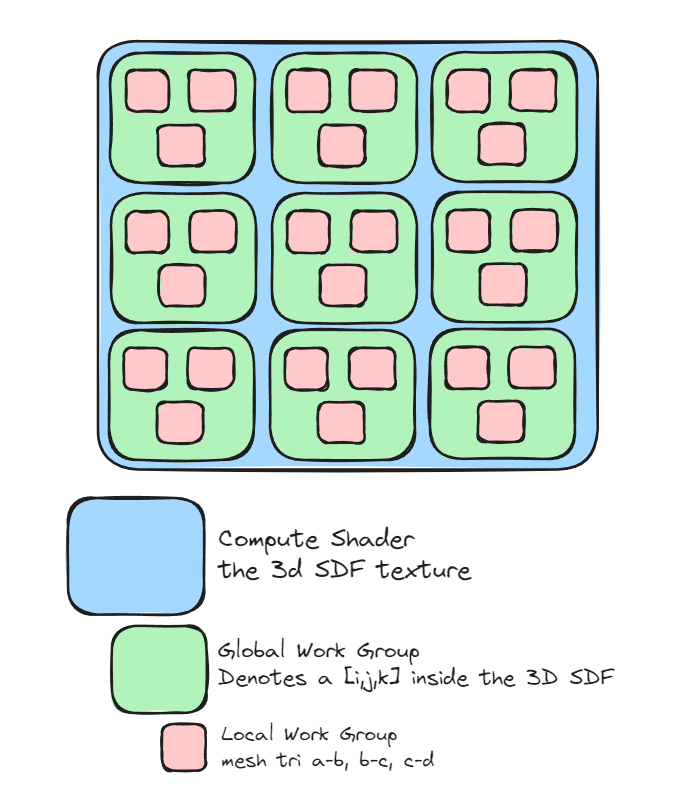

Since generating the SDF in CPU is quite slow, we're going to move the generation of the SDF 3D Texture to the GPU. I will be using the compute shader to do this, while also trying to learn how to use them.

I am planning to use the compute shader such as this.
.

Inside the a work local group, we will:
1. Find the shortest distance to a triangle for the given triangle (range: [a,b])
2. Wait until all of the local work group is done
3. Find the smallest shortest distance in all of the local work group
4. Write into a 3D Texture

We will then write the 3D texture back to CPU and compare it with our control SDF (generated by CPU). If they both matches, then we can move on to the next step of this exploration!

https://learnopengl.com/Guest-Articles/2022/Compute-Shaders/Introduction
https://developer.download.nvidia.com/assets/cuda/files/reduction.pdf

---
