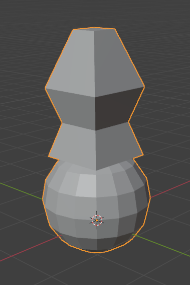
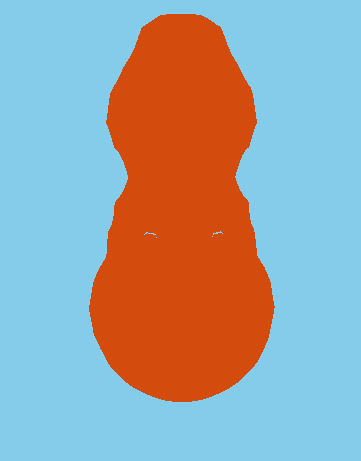
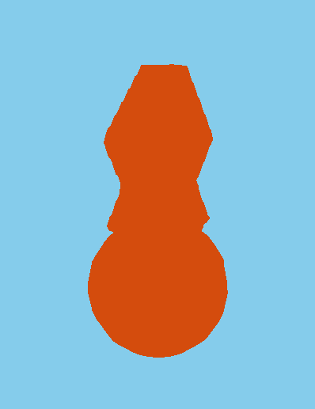
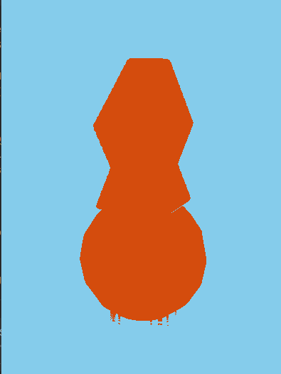

While working on the generation of 3d texture SDF on fragment shader, I decided to finish the raymarch SDF on gpu first. I just finished it, so it should still contain some bugs. Will look into it later-ish

The object I'm using is just some random object I made in 30 seconds in blender. The 3d texture SDF is still generated on the CPU side for now, hence I can't go too high since it takes forever to generate an SDF texture

| original object |  |
| 64 steps 16x16x16: |  | 
| 64 steps 32x32x32: |  |
| 64 steps 64x64x64: |  |

Some observation:
- The higher the texture resolution, the higher the lag. Something is definitly wrong in the code somewhere since the SDF raymarch algorithm shouldn't be affected by the texture size since it's just a texture sample. Will probably look into this. I suspect higher resolution = higher step count (instead of terminating early).  
- Certain artifacts still appearing regardless of the texture resolution. Probably implies there's a bug in the code somewhere.

---
