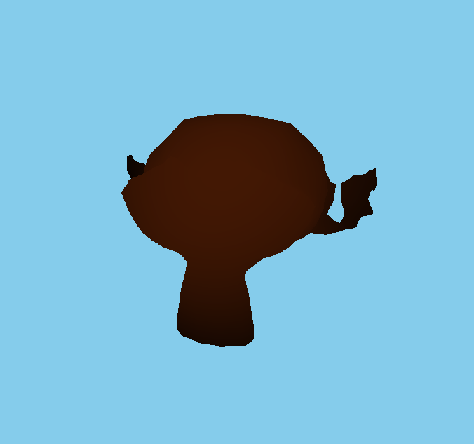
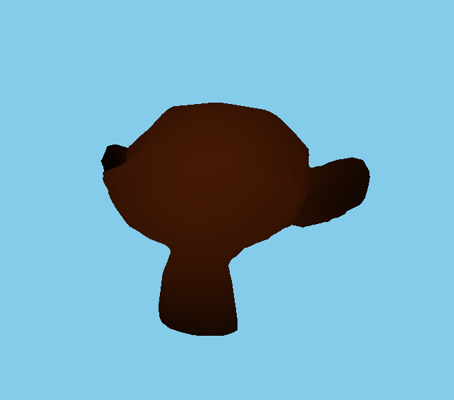
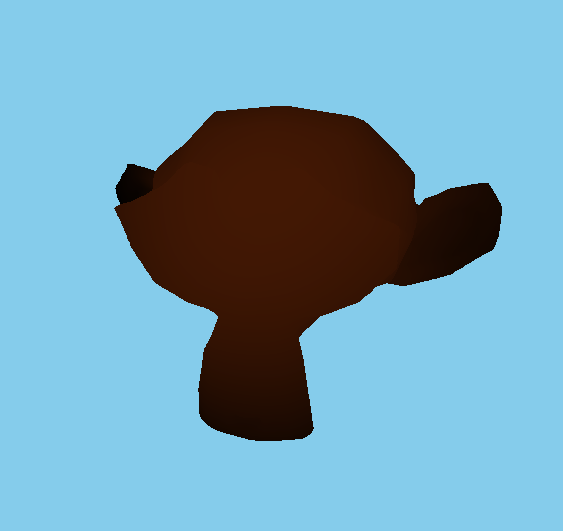

I have managed to generate the SDF in compute shader. It can calculate 64x64x64 very fast and is a very large timesaver, although it can be quite hard to debug if there are issues during the generation process

Here is the result of the SDF generation!

| 16x16x16: |  | 
| 32x32x32: |  |
| 64x64x64: |  |

The result looks quite clean to me but I will try with other meshes before making full judgement on this.

As for the code, I did use some SDF/math functions from the web directly, so I'm not sure whether it's ok to just publish it as is (I wrote the comp shader 3d texture generation and raymarch logic else myself though).

---
