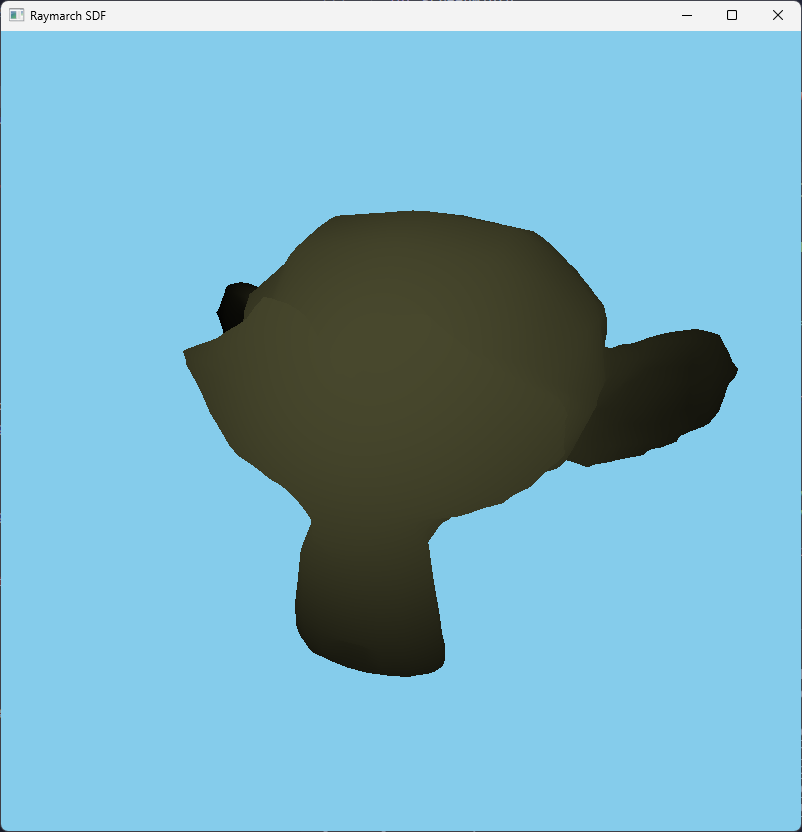
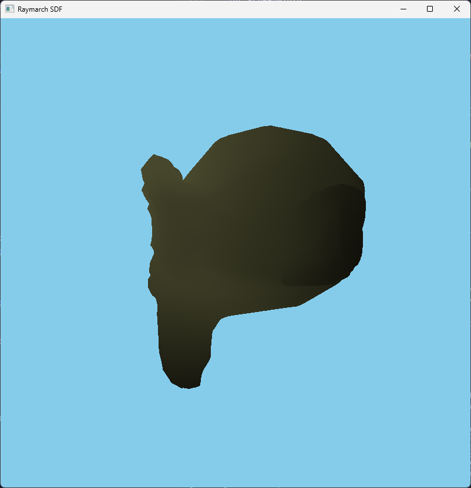
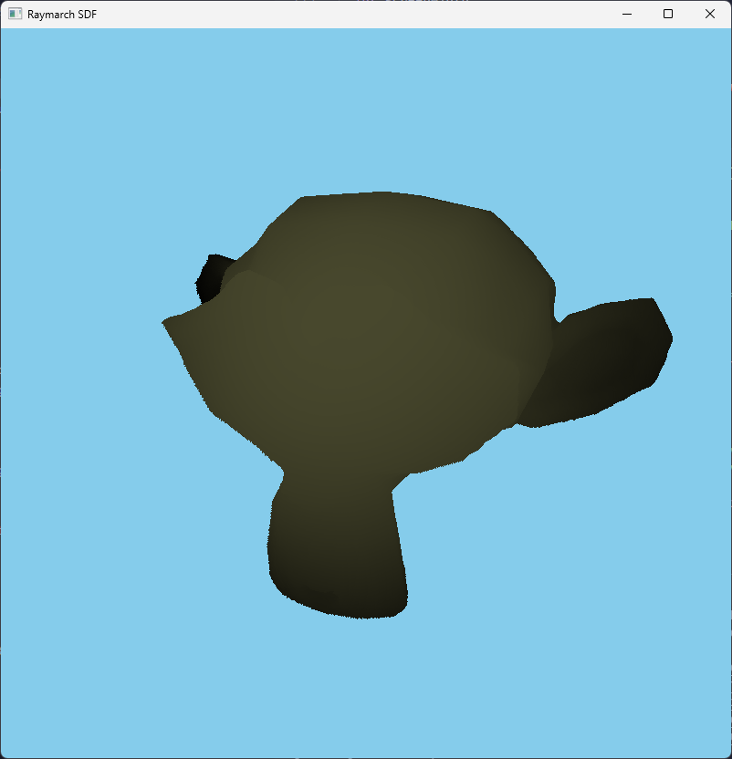
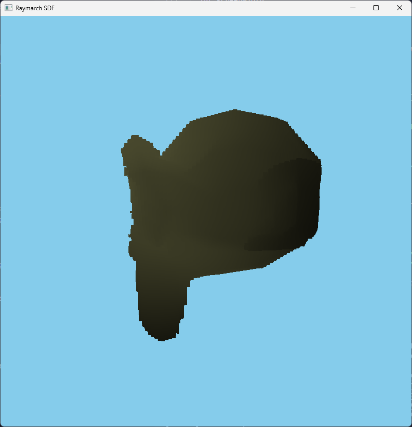

A week ago, I managed to generate SDF textures for some arbritary model using compute shader. However passing a lot of 3D textures to the shader is not that easy, especially if we have many objects later in our scene.

I thought of an idea in order to streamline multiple 3D SDFs. That is to pack the 3D texture to a 2D texture such as (64x64x64) to (4096x64). The steps will be such as:
- Generate on compute shader the 3D Texture that contains the distance information
- Dump the 3d texture data on the CPU side and do the following mapping (calculate 2D X,Y from 3D x,y,z): 
  - X: x + z\*64. This means maximum SDF resolution on X axis is 64.
  - Y: y 
- Add another offset angle on the Y axis in order to pass multiple data, so we use 4096x4096 texture to store multiple sdf information. On the texture, every 4096x64 is reserved for 1 sdf model and is tracked with such a struct:

```glsl
struct PackedSdfOffsetDetail {
    mat4 modelMat;
    mat4 invModelMat;
    vec4 innerBBMin;
    vec4 innerBBMax;
    vec4 outerBBMin;
    vec4 outerBBMax;
    int atlasIndex;
    int atlasOffset;
};

layout (std430, binding = 0) buffer PackedSdfOffsetDetailBuffer {
    int offsetSize;
    PackedSdfOffsetDetail offsets[];
};
```
- Then we can write a function that receives a position in the world coord + some SDF offset information and spits back the 2d texture coord.
```glsl
vec2 ConvertWorldToTexture(vec3 worldPos, vec3 boxMin, vec3 boxSize, int atlasOffset)
{
    float textureWidth = 4096;
    float textureHeight = 4096;

    int cubeCount = 64;
    vec3 texturePos3D = (worldPos - boxMin) / (boxSize / vec3(cubeCount));
    float x = texturePos3D.x;
    float y = texturePos3D.y;
    float z = floor(texturePos3D.z);

    vec2 texturePos2D = vec2(
        (x / textureWidth) + (z * 64.0 / textureWidth),
        (y / textureHeight) + (atlasOffset * 64.0 / textureHeight) // Y coordinate
    );

    return texturePos2D;
}
```
- We can then raymarch it like usual.

**Result:**

| 3D Texture (64x64x64): |  |  |
| 2D Texture (4096x64): |  |  |

- Overall it's close enough.
- However, the 2D texture is quite blocky when raymarched and viewed from the side. This is because on the Z axis, we can no longer rely on OpenGL's default GL_LINEAR distance interpolation when we are sampling the texture. We can do this manually but I will let it be for now.


---
