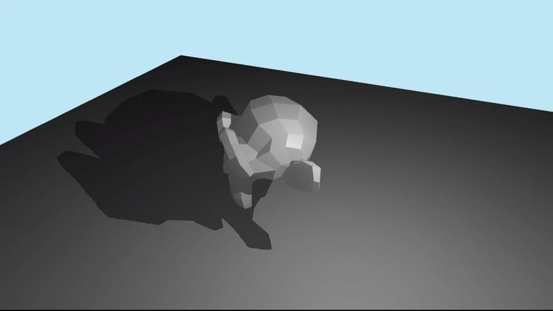
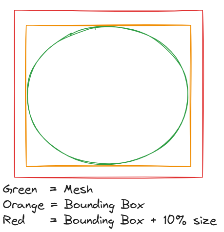
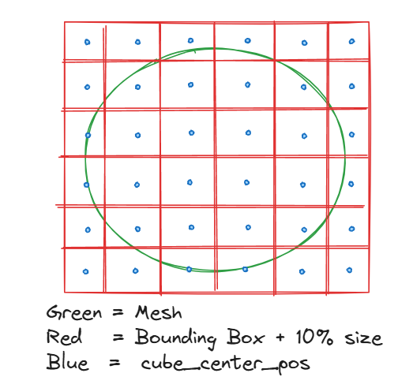
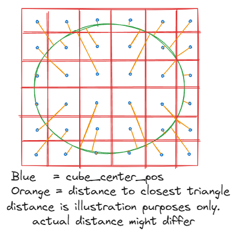
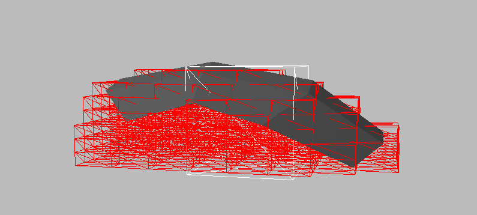
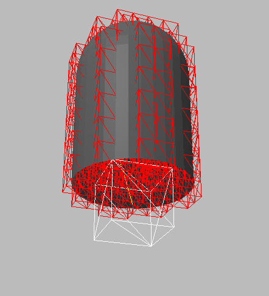
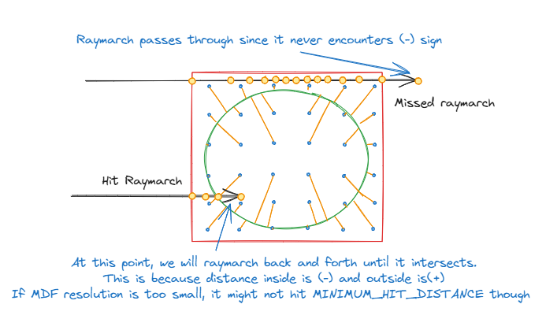
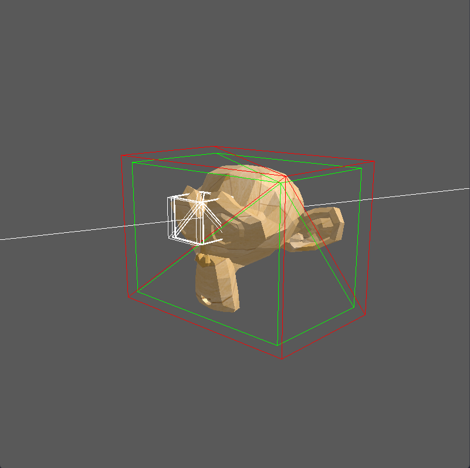
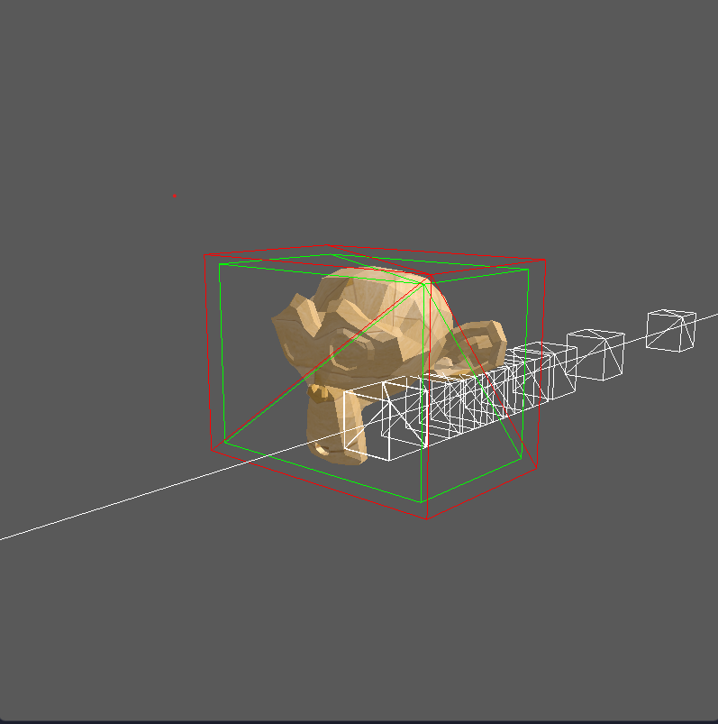
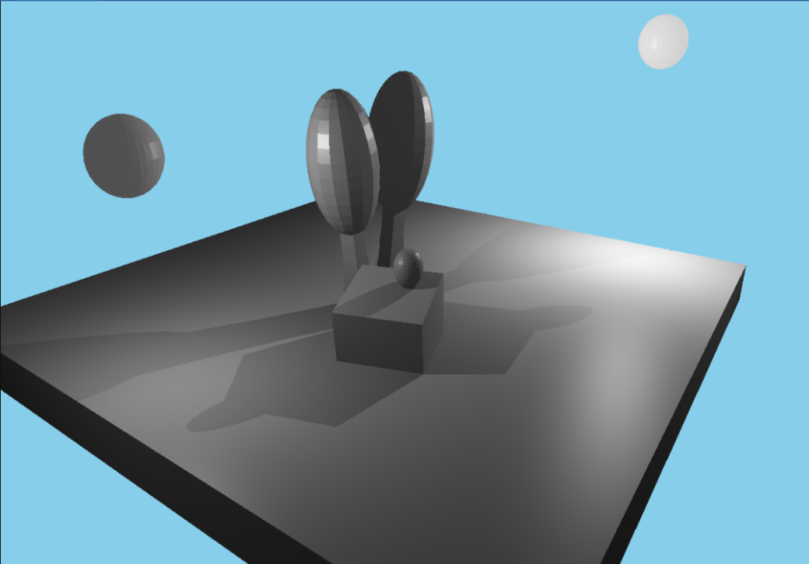

# What is it?

A **Mesh Distance Field** (MDF) is another representation of a 3D mesh. It stores the distance to the closest triangle in a 3D texture, which we call **Signed Distance Field** (SDF). We will then use raymarcing + MDF in order to check whether a mesh occludes our fragment to the light to produce shadows.

*Dynamic shadows generated from raymarching mesh distance field.*


### Pros:
- Cheaper to query compared to a full raytrace of the triangle mesh.
- Can be accelerated even more with acceleration structures such as kd-tree.
### Cons:
- Generating the MDF can be quite tricky to implement and prone to errors.
- Shapes such as small foliage leaves might be quite tricky to represent with MDFs.
- Needs extra work to handle alpha/transparency layers.

I have not yet fully compare the performance and behavior of this technique compared to **standard/cascaded shadow mapping**, but I will probably try it out as I further develop my game or engine!

# Following along:
If you want to follow along, you probably need to be familiar with the following:
- Game dev mathematics (linear algebra)
- Compute Shaders (requires OpenGL 4.2, so mac people probably can generate it on CPU instead of GPU since their latest supported OGL is 4.1)
- Some familiarity with c++, glfw, assimp, glm, and glad.
- Modern OpenGL rendering pipeline (with vertex and fragment shaders)
    - SSBO: https://www.khronos.org/opengl/wiki/Shader_Storage_Buffer_Object
    - UBO: https://learnopengl.com/Advanced-OpenGL/Advanced-GLSL
    - Compute Shaders: https://learnopengl.com/Guest-Articles/2022/Compute-Shaders/Introduction

You can find the code used here: 
| Link | Description |
|---|---|
| [main.cpp](https://github.com/andreasterrius/AletherEngine/blob/master/cmd/mesh_distance_field_tutorial/main.cpp) | contains the the int main() and all the opengl setups
| [Compute Shader.cs](https://github.com/andreasterrius/AletherEngine/blob/master/src/renderer/sdf_generator_gpu_v2.cs)<br/>[Compute Shader (include)](https://github.com/andreasterrius/AletherEngine/blob/master/src/renderer/sdf_generator_gpu_v2_shared.cpp) | The compute shader includes the shared.cpp so it can be run on CPU side as well (for debugging purposes) 
| [Scene Shader VS](https://github.com/andreasterrius/AletherEngine/blob/master/src/shaders/mdf/scene_renderer.vs)<br/>[Scene Shader FS](https://github.com/andreasterrius/AletherEngine/blob/master/src/shaders/mdf/scene_renderer.fs)<br/>[Raymarcher (include)](https://github.com/andreasterrius/AletherEngine/blob/master/src/shaders/mdf/sdf_atlas_3d.fs) | Normal vertex shader and fragment shader with a raymarcher code pulled in with #include

There are some other included files, but most of them can be checked from the include paths directly.

# Pipeline overview
1. Generate **mesh distance field (MDF).**
2. Raster the 3D scene as normal.
3. During raster, do occluson check fragment -> light.

I will be copy pasting the snippets of the code, if you want to check the full code you can also check the end of this guide.

---
### 1. Generate mesh distance field (MDF) using compute shader.
We only generate the mesh distance field once, we can also save it and load it so we don't need to generate it for each application run. For illustration purposes, I will be using 2D drawings, but you can imagine it as a 3D object, the principle should remain the same.

1. Load the mesh, we are using assimp in this case (wrapped in [Model class](https://github.com/andreasterrius/AletherEngine/blob/master/src/data/model.cpp))

>**_NOTE_**: The span of the MDF will be generated from bigger RED bounding box. 
> During the raymarch later if we're still outside we will step as much as the distance to the ORANGE bounding box. This guarantees that the raymarch point is inside the MDF instead of at the boundaries. 
```c++
// Load using assimp.
const aiScene *scene = importer.ReadFile(
      path, aiProcess_Triangulate | aiProcess_GenSmoothNormals |
                aiProcess_FlipUVs | aiProcess_CalcTangentSpace |
                aiProcess_GenBoundingBoxes);

// Bounding box accessed such as this
auto inner_bb = monkey_mesh.boundingBox;
auto outer_bb = monkey_mesh.boundingBox.apply_scale(Transform{
    .scale = vec3(1.1, 1.1, 1.1),
});
```
2. Load the compute shader in preparation to generate the MDF.
```C++
  auto mdf_generator_shader = ComputeShader(
      std::string(ALE_ROOT_PATH) + "/src/renderer/sdf_generator_gpu_v2.cs");
```
3. Pass vertices, indices, bounding boxes data to the compute shader (SSBO and UBO)
```c++
  glUseProgram(mdf_generator_shader.id);

  // Upload all required data for the generator to work
  {
    unsigned int vertex_buffer;
    unsigned int index_buffer;
    unsigned int ubo;

    glGenBuffers(1, &vertex_buffer);
    glBindBuffer(GL_SHADER_STORAGE_BUFFER, vertex_buffer);
    glBufferData(GL_SHADER_STORAGE_BUFFER,
                 mesh.vertices.size() * sizeof(Vertex), mesh.vertices.data(),
                 GL_STATIC_DRAW);

    glGenBuffers(1, &index_buffer);
    glBindBuffer(GL_SHADER_STORAGE_BUFFER, index_buffer);
    glBufferData(GL_SHADER_STORAGE_BUFFER,
                 mesh.indices.size() * sizeof(unsigned int),
                 mesh.indices.data(), GL_STATIC_DRAW);

    auto outer_bb = mesh.boundingBox.apply_scale(Transform{
        .scale = vec3(1.1, 1.1, 1.1),
    });
    auto gpu_data = GpuData{
        ivec4(mesh.vertices.size(), mesh.indices.size(), 0, 0),
        vec4(mesh.boundingBox.min, 0.0), vec4(mesh.boundingBox.max, 0.0),
        vec4(outer_bb.min, 0.0), vec4(outer_bb.max, 0.0)};

    glGenBuffers(1, &ubo);
    glBindBuffer(GL_UNIFORM_BUFFER, ubo);
    glBufferData(GL_UNIFORM_BUFFER, sizeof(GpuData), &gpu_data, GL_STATIC_DRAW);

    // wait until the upload is done
    glMemoryBarrier(GL_SHADER_STORAGE_BARRIER_BIT);

    glBindBufferBase(GL_SHADER_STORAGE_BUFFER, 2, vertex_buffer);
    glBindBufferBase(GL_SHADER_STORAGE_BUFFER, 3, index_buffer);
    glBindBufferBase(GL_UNIFORM_BUFFER, 4, ubo);
  }
```
4. Create 3D texture to hold the resulting MDF generation
```c++
  unsigned int texture_id;
  {
    glGenTextures(1, &texture_id);
    glBindTexture(GL_TEXTURE_3D, texture_id);
    glTexImage3D(GL_TEXTURE_3D, 0, GL_R32F, mdf_resolution, mdf_resolution,
                 mdf_resolution, 0, GL_RGBA, GL_FLOAT,
                 nullptr /*empty texture*/);

    glTexParameteri(GL_TEXTURE_3D, GL_TEXTURE_WRAP_S, GL_REPEAT);
    glTexParameteri(GL_TEXTURE_3D, GL_TEXTURE_WRAP_T, GL_REPEAT);
    glTexParameteri(GL_TEXTURE_3D, GL_TEXTURE_WRAP_R, GL_REPEAT);
    glTexParameteri(GL_TEXTURE_3D, GL_TEXTURE_MIN_FILTER, GL_LINEAR);
    glTexParameteri(GL_TEXTURE_3D, GL_TEXTURE_MAG_FILTER, GL_LINEAR);

    glBindTexture(GL_TEXTURE_3D, 0);
  }
```
5. Run the compute shader
```c++
  // Run the compute shader
  {
    glBindImageTexture(0, texture_id, 0, GL_TRUE, 0, GL_READ_WRITE, GL_R32F);
    glDispatchCompute(mdf_resolution, mdf_resolution, mdf_resolution);
    glMemoryBarrier(GL_SHADER_IMAGE_ACCESS_BARRIER_BIT |
                    GL_TEXTURE_UPDATE_BARRIER_BIT);
  }
```

6. The compute shader will then generate our MDF, let's break it down one by one.
Here are the bindings that the compute shader will receive (vertices, indices, bbox):

```glsl
layout (local_size_x = 1, local_size_y = 1, local_size_z = 1) in;
layout (r32f, binding = 0) uniform image3D imgOutput;

struct Vertex {
    vec4 position;
    vec4 normal;
    vec2 tex_coords;
    vec4 tangent;
    vec4 bitangent;
    ivec4 bone_ids;
    vec4 weights;
};
layout (std430, binding = 2) buffer VertexBuffer {
    Vertex vertices[];
};
layout (std430, binding = 3) buffer IndexBuffer {
    uint indices[];
};
layout (std140, binding = 4) uniform BoundingBox {
    ivec4 buffer_size;
    vec4 inner_bb_min;
    vec4 inner_bb_max;
    vec4 outer_bb_min;
    vec4 outer_bb_max;
};
```
7. Since we're using `glDispatchCompute(mdf_resolution, mdf_resolution, mdf_resolution);`, the compute shader will be executed once for each for each cube_center_pos (blue point) shown below. 

*The compute shader will run for every blue point (cube_center_pos).*
```glsl
// We can find the current coord (cube_center_pos) with
vec3 texel_coord = gl_GlobalInvocationID.xyz

// we can now calculate the boundaries of each cube_center_pos
vec3 cube_size = vec3((outer_bb_max.x - outer_bb_min.x) / image_size.x,
                    (outer_bb_max.y - outer_bb_min.y) / image_size.y,
                    (outer_bb_max.z - outer_bb_min.z) / image_size.z);

// calculate the world pos for this cube_center_pos
vec3 cube_center_pos = (outer_bb_min + cube_size / vec3(2)) + cube_size * vec3(texel_coord);
```
8. Now, we will try to find the distance from cube_center_pos to all triangles. 
There are some other functions called from this code, you can take a look at them [here](https://github.com/andreasterrius/AletherEngine/blob/master/src/renderer/sdf_generator_gpu_v2_shared.cpp) (note: both glsl and .cpp shared the code for debugging purposes).
```glsl
  // Shortest distance that we will actually use to check
  float shortest_check_distance = 1000000.0;

  // Used to temporarily hold data when we found the shortest distance
  float shortest_distance = 1000000.0;
  vec3 shortest_point = vec3(0.0);
  vec3 shortest_normal = vec3(0.0);

  // For all triangles in the mesh
  for (int i = 0; i < indices_size; i += 3) {
    Vertex a = vertices[indices[i]];
    Vertex b = vertices[indices[i + 1]];
    Vertex c = vertices[indices[i + 2]];

    // Find the distance
    vec3 closest_point = closest_point_on_triangle(
        cube_center_pos, vec3(a.position), vec3(b.position), vec3(c.position));

    // Calculate triangle normal
    vec3 ab = vec3(b.position) - vec3(a.position);
    vec3 ac = vec3(c.position) - vec3(a.position);
    vec3 normal = normalize(cross(ab, ac));

    // normal * vec(0.0001) is used to prevent an edge case from happening
    // however explaining this will be quite long, perhaps on another guide.
    // in short it has something to do with 1 face consisting 2 triangles sharing the same vertices!  
    float check_dist = distance(closest_point + normal * vec3(0.0001), cube_center_pos);
    if (check_dist < shortest_check_distance) {
      // Update shortest distance.
      shortest_check_distance = check_dist;

      // Save information.
      shortest_distance = distance(closest_point, cube_center_pos);
      shortest_point = closest_point;
      shortest_normal = normal;
    }
  }

  // To determine sign, we will use dot product method here.
  // Basically: if direction of (closest_point->cube_center_pos) is the same as  triangle normal direction
  //    then INSIDE else OUTSIDE.
  // NOTE:
  // There are other methods, but I will probably fully explain it in another article.
  // for example, unreal checks whether 50% of hit faces is backface/not to determine it
  // of another way we can trace from point on X or Y or Z axis and count odd/even intersection.
  float t = dot(shortest_normal, normalize(cube_center_pos - shortest_point));
  if (t < 0) {
    shortest_distance = -abs(shortest_distance);
  }

  // Store distance to 3D texture (MDF).
  imageStore(imgOutput, texel_coord, vec4(shortest_distance, 0.0, 0.0, 0.0));
```


9. The MDF will be generated!


Our 3D texture now contains the distance (+ or -) the closest triangle closest to each blue point (cube_center_pos).
For example:
- print(image[0][0][0]); -> **6.14** (outside)
- print(image[0][3][3]); -> **-7.12** (inside)

Some visualization (red = inside, outside cubes are not shown):

*Open Mesh*


*One Sided Mesh (simple)*

---

### 2. Raster the 3D scene as normal.
In this step, you basically just render the scene as normal.
1. Load the render_shader 
The render_shader is just a normal blinn-phong shader from LearnOpenGL tutorials, we will modify it with raymarching on the next step.
```c++
  auto render_shader =
      Shader((std::string(ALE_ROOT_PATH) + "/src/shaders/mdf/scene_renderer.vs")
                 .c_str(),
             (std::string(ALE_ROOT_PATH) + "/src/shaders/mdf/scene_renderer.fs")
                 .c_str());
```
2. Then render the scene
```c++
void render_scene(unsigned int mdf, Transform &monkey_transform,
                  Shader &render_shader, Mesh &monkey_mesh, Mesh &floor_mesh,
                  Camera &camera) {
  render_shader.use();

  // common information
  render_shader.setVec4("diffuseColor", vec4(1.0, 1.0, 1.0, 0.0));
  render_shader.setMat4("view", camera.GetViewMatrix());
  render_shader.setMat4("projection", camera.GetProjectionMatrix());
  render_shader.setVec3("viewPos", camera.Position);
 
  // pass the mdf information here later...
  // we will insert 3.1 snippet here.

  // render monkey
  render_shader.setMat4("model", monkey_transform.get_model_matrix());
  monkey_mesh.Draw(render_shader);

  // render floor, move it down a little bit + scale it to be a bit larger.
  auto floor_transform = Transform{.translation = vec3(0.0f, -5.0f, 0.0f),
                                   .scale = vec3(2.0f, 1.0f, 2.0f)};
  render_shader.setMat4("model", floor_transform.get_model_matrix());
  floor_mesh.Draw(render_shader);
}
```

---
### 3. During raster, do occlusion check from fragment to light.
1. Pass the MDF information to the render_shader
```c++
  // pass the mdf information
  auto inner_bb = monkey_mesh.boundingBox;
  auto outer_bb = monkey_mesh.boundingBox.apply_scale(Transform{
      .scale = vec3(1.1, 1.1, 1.1),
  });
  render_shader.setMat4("mdf.modelMat", monkey_transform.get_model_matrix());
  render_shader.setMat4("mdf.invModelMat",
                        inverse(monkey_transform.get_model_matrix()));
  render_shader.setVec3("mdf.innerBBMin", inner_bb.min);
  render_shader.setVec3("mdf.innerBBMax", inner_bb.max);
  render_shader.setVec3("mdf.outerBBMin", outer_bb.min);
  render_shader.setVec3("mdf.outerBBMax", outer_bb.max);
  render_shader.setVec3("mdf.resolution", vec3(64));

  glActiveTexture(GL_TEXTURE0);
  glBindTexture(GL_TEXTURE_3D, mdf);
```

2. Afterwards, let's modify the render_shader to include the raymarching code.
```glsl
// on the scene_renderer.fs
void main(){
    ...
    // calculate shadow
    float shadow = ShadowCalculation(fs_in.FragPos, lightPos, normal);
    lighting += (ambient + (1.0 - shadow) * (diffuse + specular)) * color;
    lighting *= color;
    ...

    FragColor = vec4(lighting, 1.0);
}
```

3. The ShadowCalculation code triggers the raymarch.
```glsl
float ShadowCalculation(vec3 fragPos, vec3 lightPos, vec3 normalDir)
{
    vec3 lightDir = normalize(lightPos - fs_in.FragPos);
    vec3 isectPos = vec3(0.0);
    vec3 boxCenter = vec3(0.0);

    // + (normalDir * 0.05) -> prevents self intersect but cannot ignore self intersection fully because of possible self shadow
    // + (lightDir * 0.05) -> prevents bleeding by escaping the really close to boundaries sdfs
    bool occluded = raymarch(fragPos + (normalDir * 0.05) + (lightDir * 0.05), lightDir, distance(lightPos, fragPos), isectPos, boxCenter);

    if (occluded) {
        return 1.0;
    }
    return 0.0;
}
```

4. The raymarching code, we basically tries to step 100 times and terminates if 
    - We marched past the distance(rayStart, light), which means no MDF intersection = not occluded
    - 100 steps has occurred and no MDF intersection has been found = not occluded
    - The next march distance is smaller than MINIMUM_HIT_DISTANCE = MDF intersection found = occluded
 

```glsl
bool raymarch(vec3 rayWo, vec3 rayWd, float maxTraceDist, out vec3 isectPos, out vec3 objectCenter) {
    const int NUMBER_OF_STEPS = 100;
    const float MINIMUM_HIT_DISTANCE = 0.01;
    const float MAXIMUM_TRACE_DISTANCE = maxTraceDist;
    const vec3 NO_HIT_COLOR = vec3(0.52, 0.8, 0.92);
    const vec3 SDF_COLOR =  vec3(0.89, 0.89, 0.56);
    const vec3 oriRayWo = rayWo;

    for (int i = 0; i < NUMBER_OF_STEPS; ++i)
    {
        vec3 rayLo = vec3(mdf.invModelMat * vec4(rayWo, 1.0));
        vec3 rayLd = vec3(normalize(mdf.invModelMat * vec4(rayWd, 0.0)));

        float dist = distance_from_box_minmax(rayLo, mdf.innerBBMin, mdf.innerBBMax);
        float outerDist = distance_from_box_minmax(rayLo, mdf.outerBBMin, mdf.outerBBMax);
        if(outerDist < 0.0) {
            dist = distance_from_texture3D(rayLo, mdf.outerBBMin, mdf.outerBBMax);
        }

        rayWo = vec3(mdf.modelMat * vec4(rayLo+rayLd*dist, 1.0));
        if(distance(rayWo, oriRayWo) > MAXIMUM_TRACE_DISTANCE) {
            return false;
        }
        if(dist < MINIMUM_HIT_DISTANCE)
        {
            isectPos = rayWo;
            objectCenter = (vec3(mdf.innerBBMin) + vec3(mdf.innerBBMax))/2.0;
            return true;
        }
    }
    return false;
}
```

An illustration for the result of the raymarch against the MDF (64x64x64):
| Raymarch | Result |
|---|---|
| Intersection found |  |
| Intersection not found |  |

We can get some sweet shadows!



---
# Onwards...
My actual implementation is a bit trickier since I decide to repack the 3D texture to a 2D texture (flattening the Z to the X axis). This removes the texture interpolation but it's now possible to bind pass multiple objects more easily to the shader.

Some possible points of improvements:
- Soft shadows should be possible but I'm still cooking:
    - The traditional way is probably to sample an area light multiple times and take the average, but this will be expensive.
    - It seems to be possible to just hack the soft shadow based on distance, but I need to cook it a bit more.
- Raymarch on a separate pass and not on the fragment shader since it's wastes performance.
- The AxAxA resolution feels rigid, perhaps we can have higher resolution on more dense area of the mesh vs just uniformly spacing the distance field.
- Try to get foliage (with transparency) implementation down.
- Pass texture to the models and perhaps we can create a simple beautiful low poly scene just for fun!


# Resources used
- https://dev.epicgames.com/documentation/en-us/unreal-engine/mesh-distance-fields-in-unreal-engine
- https://kosmonautblog.wordpress.com/2017/05/01/signed-distance-field-rendering-journey-pt-1/
- https://kosmonautblog.wordpress.com/2017/05/09/signed-distance-field-rendering-journey-pt-2/  
