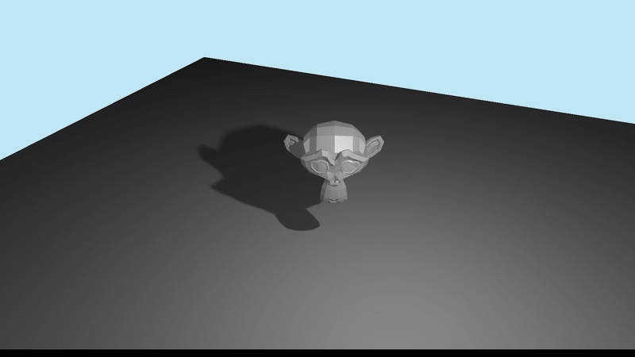

## What is it?




In [SDF Shadow Guide](), we have created a way to find whether a point is occluded using a general SDF solution. However, it is only an occlusion check (either 0 or 1) but in real life, usually we will have soft shadow depending on the grazing distance to the surface of the object.

There's a good article here by Inigo Quilez about creating soft shadow using SDFs: [https://iquilezles.org/articles/rmshadows/](https://iquilezles.org/articles/rmshadows/), which I will be implementing in this article.


In order to create soft shadows, we will consider these 3 cases below in the diagram:


- **Ray 1:** Near miss case, the originating fragment should be soft shadowed. How dark the soft shadow will be determined by (how close the evaluated point is to surface over how far we have traveled -> ex: d1/t1 or d2/t2 and so forth). We will need to find the closest point (as possible) to the surface.
- **Ray 2:** Should be fully shadowed.
- **Ray 3:** Complete miss, should be fully lighted.

First, we will need to sample and calculate for each raymarch point. However, we only run the calculation when inside the bounding box of the SDF. This is because it's not that trivial to calculate the closest distance to object outside of it.
```glsl
  if(outerDist < 0.0) {
      dist = distance_from_texture3D(rayLo, mdf.outerBBMin, mdf.outerBBMax);
      shadow = min(shadow, dist*k/(t+0.0001));
  }
```

This could cause issue if **k** is small (wide shadow), then the shadow can be cut-off by the bounding box (caused by not evaluating shadows outside the outer bounding box). This is a tradeoff that we will take, because I want to move on to other stuff for now.


After we have sampled, we will then just march the ray accordingly.
```glsl
  t += clamp(dist * 0.5, -MIN_STEP_DIST, MAX_STEP_DIST);
  rayWo = oriRayWo + rayWd * t;
  if (shadow < 0.0) {
      break;
  }
  if (distance(rayWo, oriRayWo) > maxTraceDist) {
      break;
  }
```

This line is a bit different than the article though.
```glsl
  t += clamp(dist * 0.5, -MIN_STEP_DIST, MAX_STEP_DIST);
```
In the article, they will always march positively (clamped to a small value), this is to create a better looking soft shadow as the ray can march past the thin edges of the object. But since our SDF texture is not as precise as actual SDF functions, it might cause some artifacts. Also thin objects can have transparent shadows where it should not. Perhaps it's possible to elegantly handle these, but we will save that for future improvements.

___
You can find the source code here:
- [Soft Shadow Raymarch Shader](https://github.com/andreasterrius/AletherEngine/blob/master/cmd/mesh_distance_field_tutorial/sdf_atlas_3d_softshadow.fs)
- [Soft Shadow Fragment Shader](https://github.com/andreasterrius/AletherEngine/blob/master/cmd/mesh_distance_field_tutorial/scene_renderer.fs)

## Resources used
- [https://iquilezles.org/articles/rmshadows/](https://iquilezles.org/articles/rmshadows/)
